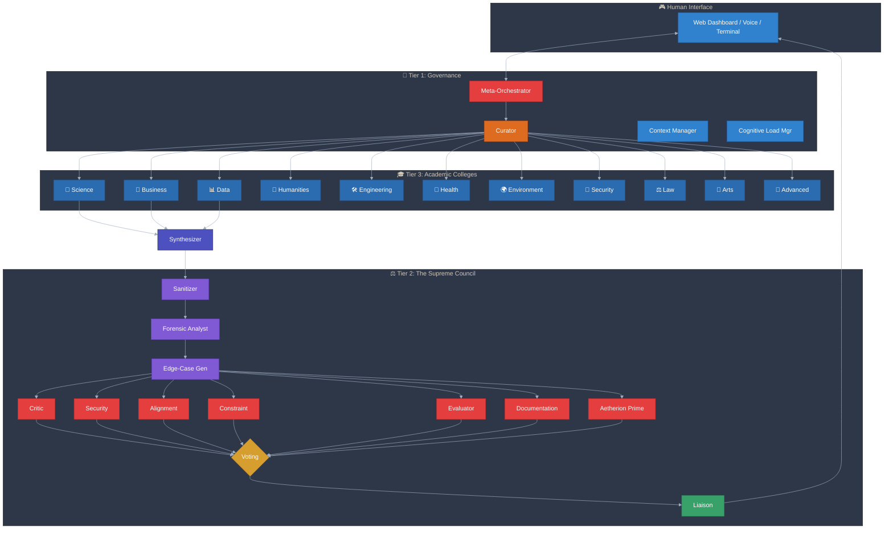
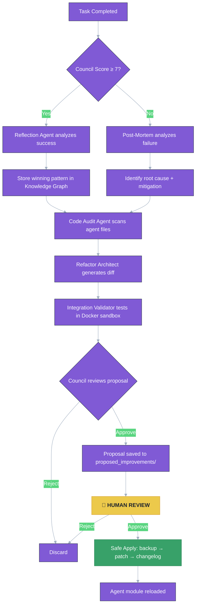
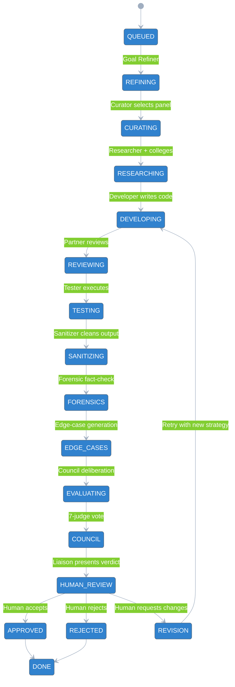

<p align="center">
  
  
  
  
  
  
</p>

<h1 align="center">
  <span style="background: linear-gradient(135deg, #667eea 0%, #764ba2 100%); -webkit-background-clip: text; -webkit-text-fill-color: transparent; background-clip: text;">
    ⚡ AETHERION v3
  </span>
</h1>

<h3 align="center">
  <i>The Autonomous AI Research Institution — Entirely Local, Entirely Yours</i>
</h3>

<p align="center">
  <b>67+ specialized agents · 11 academic colleges · 7‑judge Supreme Council · Self‑improving · Voice/Vision/Email</b>
</p>

<br>

<div align="center">
  <a href="#-quick-start">
    
  </a>
  <a href="#-architecture">
    
  </a>
  <a href="#-the-aetherion-council">
    
  </a>
  <a href="#-agent-roster">
    
  </a>
  <a href="#-security--safety">
    
  </a>
</div>

---

<br>

> <div align="center"><b>“Without structure it becomes noise. With structure it becomes powerful.”</b></div>

<br>

## 📖 Overview

Aetherion v3 is not a chatbot. It is a **fully autonomous, self-governing research organization** that operates entirely on your local machine. It combines:

- 🧠 **67+ domain‑expert agents** — from physicists to patent examiners
- 🏛️ **A Supreme Council** with veto power and bias detection
- 🔁 **Recursive delegation** — fractal teams for complex tasks
- 🧬 **Self‑improvement** — audits, refactors, and proposes its own evolution
- 🎛️ **Hardware interfaces** — voice, vision, email, cron scheduler

No cloud. No API keys. No data leaves your laptop.

---

## 🧭 Quick Start

```bash
# 1. Install Ollama and required models
curl -fsSL https://ollama.com/install.sh | sh
ollama run llama3        # primary reasoning model
ollama pull llava        # vision model

# 2. Clone and install dependencies
git clone https://github.com/yourusername/aetherion_v3.git
cd aetherion_v3
pip install -r requirements.txt

# 3. Launch the institution
python main.py
```
💡 Optional: configure email reports — see Email Setup.

---

🏛️ Architecture

Aetherion v3 is structured as a three‑tier governance model that separates orchestration, execution, and validation.



Directory Structure

```
aetherion_v3/
├── main.py                          # Entry point (all modes)
├── core/                            # Protocol, State Machine, Memory Graph
├── agents/
│   ├── governance/                  # Meta‑orchestration
│   ├── council/                     # 7‑judge panel + pipeline
│   ├── colleges/                    # 67+ domain experts (lazy‑loaded)
│   ├── pipeline/                    # Researcher, Developer, Tester...
│   ├── improvement/                 # Self‑audit and code generation
│   └── interfaces/                  # Voice, Vision, Email, Scheduler
├── missions/                        # Invention & open‑source mission modes
├── memory/                          # Persistent knowledge graph (ChromaDB)
├── output/                          # Generated code artifacts
├── reports/                         # Markdown mission reports
├── blueprints/                      # Approved invention blueprints
├── latex_docs/                      # Compiled LaTeX research documents
├── council_archive/                 # Versioned verdicts for self‑reflection
├── proposed_improvements/           # Agent changes awaiting human approval
├── backups/                         # Automatic rollback safety
└── changelog/                       # Applied improvement history
```

---

⚖️ The Aetherion Council

Every output passes through a rigorous 7‑judge peer‑review before reaching you.

Judge Power Primary Question
Critic Soft Veto What is the single strongest argument against this?
Security ABSOLUTE VETO Any vulnerabilities, secrets, or unsafe patterns?
Alignment Vote Does this match the user's actual request?
Constraint Vote Within scope and resource limits?
Evaluator Vote Quality score (0–10). Is reasoning sound?
Documentation Vote Can a stranger understand this?
Aetherion Prime Tiebreaker Safest path forward given split vote?

Pre‑Council Pipeline

Agent Role
Sanitizer Strips markdown/noise — Council reviews clean work only.
Forensic Analyst Fact‑checks: imports exist? APIs real? RAM feasible?
Edge‑Case Generator Generates adversarial inputs and boundary tests.
Juror Detects groupthink, complexity bias, and anchoring.

Post‑Council

Agent Role
Liaison Translates complex verdict into simple ✅/⚠️/❌ card.
Telemetry Monitors Council health (too strict? too lenient?).
Archivist Stores rejection patterns for future reference.

---

🤖 Agent Roster

The Curator dynamically selects the minimal viable panel for each task — you never run all 67+ agents simultaneously.

<details>
<summary><b>🧪 Natural Sciences (6 agents)</b></summary>
<p>

Agent Focus
Physicist Physical laws, energy conservation, material feasibility
Chemist Reactions, material compatibility, synthesis pathways
Biologist Living systems, genetics, ecological impacts
Mathematician Proofs, convergence, numerical stability
Astronomer Orbital mechanics, astrophysical constraints
Geologist Earth systems, mineral resources, tectonics

</p>
</details>

<details>
<summary><b>💼 Business & Economics (6 agents)</b></summary>
<p>

Agent Focus
Economist Market forces, pricing models, TAM/SAM/SOM
Enterprise Architect Organizational fit, integration cost, scalability
Finance ROI analysis, break‑even, funding requirements
Marketing Analyst Positioning, competitive landscape, GTM strategy
Legal/Compliance Regulatory frameworks, liability assessment
Supply Chain Manufacturing, logistics, sourcing risks

</p>
</details>

<details>
<summary><b>📊 Data & Analytics (5 agents)</b></summary>
<p>

Agent Focus
Data Scientist ML model design, feature engineering, validation
Statistician Hypothesis testing, significance, bias detection
Geospatial Analyst Maps, location intelligence, spatial patterns
Forecasting Time series, trend extrapolation, uncertainty bounds
Operations Research Optimization, queueing theory, logistics efficiency

</p>
</details>

<details>
<summary><b>📜 Humanities (5 agents)</b></summary>
<p>

Agent Focus
Historian Past attempts, failed projects, historical patterns
Philosopher/Ethicist Ethical implications, unintended consequences
Sociologist Cultural adoption barriers, social dynamics
Linguist Terminology, translation, clarity
Design/Creative UX heuristics, accessibility, aesthetic cohesion

</p>
</details>

<details>
<summary><b>🛠️ Engineering (5 agents)</b></summary>
<p>

Agent Focus
Systems Architect High‑level design tradeoffs, technology selection
Performance Engineer Latency, throughput, scaling limits
DevOps Deployment, infrastructure as code, CI/CD
Network Engineer Protocols, latency, bandwidth constraints
Database Specialist Schema design, query optimization, data integrity

</p>
</details>

<details>
<summary><b>🏥 Health & Medicine (6 agents)</b></summary>
<p>

Agent Focus
Medical Doctor Clinical practice, diagnostic validity, patient safety
Pharmacologist Drug interactions, dosing, pharmacokinetics
Neuroscientist Brain function, cognitive load, neural mechanisms
Biomedical Engineer Implants, devices, biocompatibility
Nutritionist Dietary claims, metabolic effects
Geneticist DNA, heredity, CRISPR ethics

</p>
</details>

<details>
<summary><b>🌍 Environment & Climate (5 agents)</b></summary>
<p>

Agent Focus
Climate Scientist Models, carbon cycles, tipping points
Ecologist Ecosystems, biodiversity, invasive species
Hydrologist Water systems, aquifers, drought management
Disaster Resilience Earthquakes, floods, extreme weather engineering
Circular Economy Waste streams, recyclability, lifecycle analysis

</p>
</details>

<details>
<summary><b>🔐 Security & Defense (4 agents)</b></summary>
<p>

Agent Focus
Red Team Adversarial thinking, penetration testing mindset
Cryptographer Encryption, hashing, key management best practices
Signals Intelligence RF, side‑channel attacks, TEMPEST
Privacy Officer GDPR/CCPA compliance, data minimization

</p>
</details>

<details>
<summary><b>⚖️ Law & Policy (4 agents)</b></summary>
<p>

Agent Focus
Patent Examiner Prior art search, novelty assessment
Regulatory Affairs FDA, FCC, FAA, SEC compliance pathways
International Trade Export controls, tariffs, sanctions
Compliance ISO, SOC2, HIPAA, PCI‑DSS requirements

</p>
</details>

<details>
<summary><b>🎨 Arts & Media (4 agents)</b></summary>
<p>

Agent Focus
Copywriter Clarity, persuasion, tone of voice
Multimedia Video/audio production feasibility, rendering estimates
Journalist Fact‑checking, source verification, narrative structure
Localization Cultural adaptation, translation nuance

</p>
</details>

<details>
<summary><b>🔮 Advanced Research (4 agents)</b></summary>
<p>

Agent Focus
Futurist Long‑term trends, scenario planning
Systems Thinker Feedback loops, unintended consequences
Interdisciplinary Bridge Cross‑domain connections, analogical transfer
Epistemologist Confidence limits, knowledge validation

</p>
</details>

---

🧬 Self‑Improvement (Controlled Evolution)

Aetherion v3 can audit its own source code, propose improvements, and even design new agents — but never without your approval.



The Agent Forge

When no existing agent can handle a task, the Agent Forge designs a new one:

1. Spec Writer drafts YAML specification (name, role, prompt, college)
2. Council reviews necessity and safety
3. Human approves creation
4. Agent Factory generates Python class and registers it

---

🛡️ Security & Safety

Absolute Veto

The Security judge has absolute veto power. If it flags any of the following, output is instantly rejected:

```
sudo · rm -rf · eval() · exec() · chmod 777 · /etc/ · fork bombs · base64 secrets
```

Human‑in‑the‑Loop (Always)

Action Automatic? Human Gate
Git commit / push ❌ Never Must manually run git push
Apply code improvements ❌ Never Review and approve diff
Store to long‑term memory ⚠️ Conditional Only if confidence ≥ 0.45
Council verdict ❌ Advisory You always have final override
Run generated code ❌ Never on host Executes only in sandboxed Docker container

Loop Protection

Mechanism Threshold
Same‑state detection 3 identical states → force forward
Agent call budget 50 max per task
Timeout 420 seconds per task
Cognitive load monitor Pauses agents if CPU/RAM exceed threshold

Sandboxed Execution

All generated code runs inside a disposable Docker container with no network, read‑only root, and automatic destruction.

---

⚙️ Task State Machine

Every mission follows a formal, non‑reversible state graph.



---

📡 Interfaces

Interface Capability Requirements
Voice Agent Microphone input → STT → TTS response SpeechRecognition, pyttsx3, pyaudio
Vision Agent Screenshot → llava analysis Pillow, pyautogui, ollama pull llava
Email Agent SMTP reports with attachments SMTP credentials (optional)
Scheduler Cron‑style autonomous job scheduling schedule library

Email Setup (optional)

```python
from agents.interfaces.interfaces import configure_email
configure_email("smtp.gmail.com", 587, "you@gmail.com", "app_password", "recipient@example.com")
```

---

🚀 Example: Invention Mode

```bash
python main.py --mode invent "Self-healing road material using bacteria"
```

Internal Flow:

```
Idea → Theory → Hypothesis → Simulation → Design → Blueprint
    ↓
Colleges Review: [Chemist, Biologist, Civil Engineer, Economist, Patent Examiner]
    ↓
Council Deliberation (7 judges + pre/post pipeline)
    ↓
Human Approval
    ↓
LaTeX Blueprint → /blueprints/self_healing_road.pdf
```

Sample Output:

· Full research document with figures
· Feasibility score and dissenting opinions
· Patent prior art analysis
· Estimated development cost and timeline

---

🚫 What Aetherion v3 Will NEVER Do

· Auto‑push to GitHub or any remote repository
· Auto‑apply code changes to its own source files
· Store low‑confidence outputs in long‑term memory
· Run untrusted code on your host operating system
· Make Council decisions without showing you the verdict and reasoning
· Bypass the Security judge's veto (unless you explicitly override)

---

🤝 Contributing

Aetherion v3 is designed to improve itself with your guidance. To contribute:

1. Run the system on diverse tasks to build its knowledge graph.
2. Review proposals in proposed_improvements/ and approve those that make sense.
3. Manually edit agent prompts in the source files if you notice systematic biases.
4. Share interesting Council verdicts and invention blueprints with the community.

Human Approval Workflow for Self‑Improvement

```bash
# List pending improvements
ls proposed_improvements/

# Review a specific proposal
cat proposed_improvements/2026-04-16_developer_prompt_optimization.diff

# Approve and apply
python main.py --apply-improvement 2026-04-16_developer_prompt_optimization

# Or manually apply with git
git apply proposed_improvements/2026-04-16_developer_prompt_optimization.diff
```

---

📜 License

MIT License — free for personal, academic, and commercial use.

---

<br>

<div align="center">
  <p>
    <b>Built for the curious. Governed by reason. Always asks permission.</b>
  </p>
  <p>
    <i>“Without structure it becomes noise. With structure it becomes powerful.”</i>
  </p>
  <br>
  
</div>


<br>

<div align="center">
  <h3>⚡ The institution is open. The Council is seated. Your first mission awaits.</h3>
</div>
