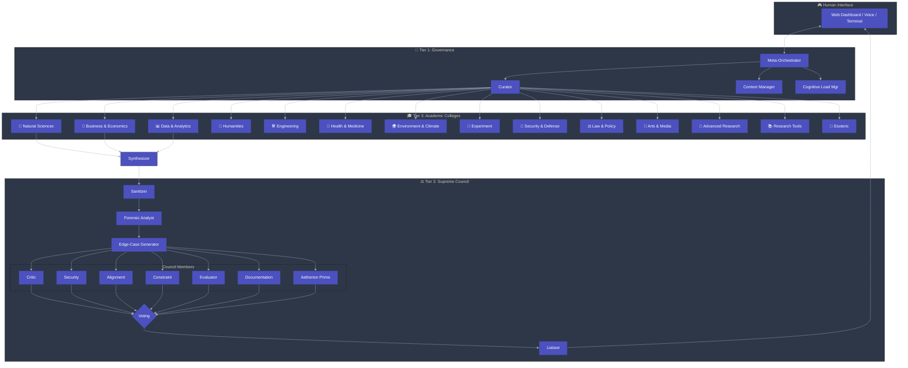
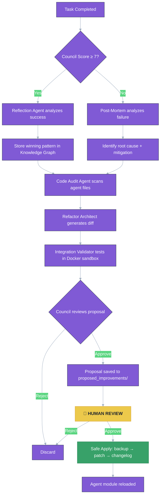
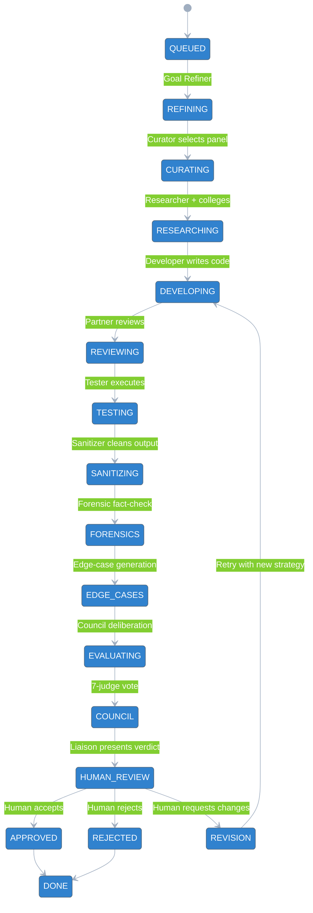

<p align="center">
  
  
  
  
  
  
</p>

<h1 align="center">
  <span style="background: linear-gradient(135deg, #667eea 0%, #764ba2 100%); -webkit-background-clip: text; -webkit-text-fill-color: transparent; background-clip: text;">
    ⚡ AETHERION v7
  </span>
</h1>

<h3 align="center">
  <i>The Autonomous AI Research Institution — Entirely Local, Entirely Yours</i>
</h3>

<p align="center">
  <b>70+ specialized agents · 14 academic colleges · 7‑judge Supreme Council · Self‑improving · Voice/Vision/Email</b>
</p>

<br>

<div align="center">
  <a href="#-quick-start">
    
  </a>
  <a href="#-architecture">
    
  </a>
  <a href="#-the-aetherion-council">
    
  </a>
  <a href="#-agent-roster">
    
  </a>
  <a href="#-security--safety">
    
  </a>
</div>

---

<br>

> <div align="center"><b>“Without structure it becomes noise. With structure it becomes powerful.”</b></div>

<br>

## 📖 Overview

Aetherion is not a chatbot. It is the **first fully autonomous AI research institution** — a self‑governing, multi‑agent system that designs experiments, searches the literature, executes code in a hardened sandbox, and peer‑reviews every finding through a 7‑judge Supreme Council. All of this runs **entirely on local hardware**, with no cloud dependencies, no API keys, and no data leaving your machine.

**70+ specialised agents** across 14 academic colleges collaborate under a governance framework that includes weighted voting, absolute security veto, reputation feedback, and a Constitution Editor that lets enterprises define their own safety rules — without touching code.

The institution is fully containerised with Docker, instrumented with Prometheus, Loki, and Grafana, and ships with a production‑grade React dashboard. Aetherion scales from a single laptop to a Kubernetes cluster with live task migration, graceful shutdown, and micro‑service agent architecture.

**Aetherion v7 is production‑hardened, GDPR/CCPA‑ready, and governed by reason — not magic.**

---

## 🧭 Quick Start

```bash
# 1. Install Ollama and required models
curl -fsSL https://ollama.com/install.sh | sh
ollama run llama3        # primary reasoning model
ollama pull llava        # vision model

# 2. Clone and install dependencies
git clone https://github.com/Lumen-Park/Aetherion.git
cd Aetherion 
pip install -r requirements.txt

# 3. Launch the institution
python main.py

(or)

### One‑Command Deployment (Docker)

```bash
# Clone the repository
git clone https://github.com/Lumen-Park/Aetherion.git
cd Aetherion-

# Copy and configure environment
cp .env.example .env
# Edit .env with your OAuth credentials (optional)

# Start the full stack (CPU)
docker-compose up

# Or with GPU acceleration (NVIDIA only)
docker-compose --profile gpu up

Once running, open your browser to:

Service URL
Web Dashboard http://localhost:8000
API Documentation (Swagger) http://localhost:8000/docs
Ollama API http://localhost:11434

No npm commands. No Python environment. Everything is pre‑packaged in the Docker image.

```
Local Development (Without Docker)

If you prefer to run Aetherion directly on your machine for development:

```bash
# Install Ollama and models
curl -fsSL https://ollama.com/install.sh | sh
ollama run llama3

# Install Python dependencies
pip install -r requirements.txt

# Run the institution (CLI mode)
python main.py --mode chat

```

The web dashboard is not served in this mode; use Docker for the full experience
## 🛡️ Security & Sandbox (Recommended)

Aetherion executes all generated code inside a secure, isolated container. For **production deployments**, we strongly recommend using [gVisor](https://gvisor.dev/) as the container runtime. gVisor adds a user‑space kernel that dramatically reduces the attack surface compared to the default Docker runtime.

### Installing gVisor

#### 🐧 Linux (Ubuntu/Debian)
```bash
# Download and install runsc
ARCH=$(uname -m)
URL=https://storage.googleapis.com/gvisor/releases/release/latest/${ARCH}
wget ${URL}/runsc ${URL}/runsc.sha512
sha512sum -c runsc.sha512
rm -f *.sha512
chmod a+rx runsc
sudo mv runsc /usr/local/bin

# Configure Docker
sudo /usr/local/bin/runsc install
sudo systemctl restart docker

```
## 🔏 Tamper‑Proof Audit Logging (Recommended)

Aetherion v3.3 includes a cryptographically chained, append‑only audit log for all human overrides. To enable digital signatures and external verification, generate an RSA key pair:

```bash
# Generate private key (keep this secret, never commit)
openssl genrsa -out audit_private.pem 2048

# Extract public key (safe to share for verification)
openssl rsa -in audit_private.pem -pubout -out audit_public.pem

# Set environment variable for the private key path
export AETHERION_AUDIT_PRIVATE_KEY=/absolute/path/to/audit_private.pem

```
## 📦 Dashboard Integration (For Developers)

The Aetherion web dashboard is built with **React + Vite** and pre‑compiled into static files that are served directly by the FastAPI backend. End users do **not** need to run any `npm` commands—the dashboard is already packaged inside the Docker image.


If you want to modify the dashboard or build it from source, follow these steps:

### 1. Build the Dashboard Locally

```bash
cd dashboard
npm install
npm run build   # Creates `dist/` folder with static files
```

2. Update Dockerfile.api to Include the Built Dashboard

Ensure your Dockerfile.api contains the following line to copy the built dashboard into the API's static directory:

```dockerfile
# Copy the pre‑built dashboard static files
COPY dashboard/dist /app/api/static
```

Full Dockerfile.api example:

```dockerfile
FROM python:3.11-slim

WORKDIR /app

RUN apt-get update && apt-get install -y --no-install-recommends \
    curl \
    portaudio19-dev \
    && rm -rf /var/lib/apt/lists/*

COPY requirements.txt .
RUN pip install --no-cache-dir -r requirements.txt

COPY . .

# Serve the React dashboard from FastAPI's static directory
COPY dashboard/dist /app/api/static

EXPOSE 8000

CMD ["uvicorn", "api.main:app", "--host", "0.0.0.0", "--port", "8000"]
```

3. Deploy with Docker Compose

No changes are needed in docker-compose.yml—the api service already exposes port 8000. Rebuild and start the stack:

```bash
docker-compose up --build
```

4. Access the Dashboard

Open your browser to http://localhost:8000. You will see the full React dashboard.

---

For end users: The dashboard is included automatically when you run docker-compose up. No additional steps are required.

```

Aetherion will be available at http://localhost. The dashboard is at http://localhost:3000.

Local Development (Without Docker)

```bash
# Install Ollama and models
curl -fsSL https://ollama.com/install.sh | sh
ollama run llama3

# Install Python dependencies
pip install -r requirements.txt

# Run the institution
python main.py --mode chat
```
💡 Optional: configure email reports — see Email Setup.

---
## 🧩 Optional: Deploy Agents as Independent Microservices

Aetherion v3.4 supports running every domain expert as a standalone microservice. This gives you fault isolation, independent scaling, and the ability to update individual agents without redeploying the entire institution.

### Generate Agent Services

Run the included script to create Docker Compose entries for all 70+ agents:

```bash
python scripts/generate_agent_services.py >> docker-compose.yml
```

Then start the stack normally:

```bash
docker-compose up -d
```

Each agent now runs in its own Docker container and communicates with the orchestrator via HTTP. The system automatically discovers and calls the correct agent based on the Curator’s selection.

Scaling Individual Agents

You can scale any agent independently, for example:

```bash
docker-compose up -d --scale physicistagent=3
```

Returning to Monolithic Mode

If you prefer the original single‑process deployment, simply remove or comment out the generated agent services from docker-compose.yml and restart.

## 💾 Backup & Restore

Aetherion stores all persistent data (knowledge graph, audit logs, workspace configurations, and Council verdicts) in local directories. Back up these directories regularly to prevent data loss.

### Manual Backup (Quick)

Run these commands from your Aetherion project root:

```bash
# Backup all critical data to a timestamped archive
tar -czf backup_$(date +%Y%m%d).tar.gz memory/ audit/ workspaces/ council_archive/ logs/ reports/

# To restore, extract the archive
tar -xzf backup_20260401.tar.gz
```

Docker Volume Backup

If you use Docker volumes, back up a specific volume with:

```bash
docker run --rm -v aetherion_memory:/data -v $(pwd):/backup alpine tar czf /backup/memory_backup.tar.gz -C /data .
```

Automated Daily Backup (Optional Cron)

Add a cron job on the host machine to run the backup script every night at 3:00 AM:

```bash
0 3 * * * cd /path/to/Aetherion- && python scripts/backup.py
```

(Replace /path/to/Aetherion with your actual project path.)

Backup Script

A dedicated Python backup script is available at scripts/backup.py. It archives all critical directories into ./backups/:

```bash
python scripts/backup.py
```

To restore from a backup:

```bash
python scripts/restore.py backups/aetherion_backup_20260401_030000.tar.gz
```
## Kubernetes Deployment (Optional)

A sample Kubernetes deployment is provided in `k8s-deployment.yaml`. It includes liveness and readiness probes that call the API’s health endpoints.

### Deploy to your cluster

```bash
kubectl apply -f k8s-deployment.yaml
```

The deployment will create 2 replicas of the Aetherion API, automatically restarting any pod that becomes unhealthy and waiting until each pod is ready before sending traffic to it.

Health Endpoints

Endpoint Purpose
/health/live Liveness probe – returns 200 if the process is running
/health/ready Readiness probe – returns 200 if Ollama and ChromaDB are available

These endpoints are used by the Kubernetes probes defined in the deployment YAML.


---

🏛️ Architecture

Aetherion v3 is structured as a three‑tier governance model that separates orchestration, execution, and validation.



Directory Structure

```
 Aetherion/
├── main.py                          
├── core/                            
│   ├── protocol.py                  
│   ├── task_state.py                
│   ├── memory.py                    
│   ├── auth.py                      
│   ├── oauth.py                     
│   └── workspace.py                 
├── agents/                          
│   ├── colleges/
│   │   ├── base.py                  
│   │   └── all_colleges.py         
│   ├── council/
│   │   └── council.py               
│   ├── governance/
│   │   ├── meta_orchestrator.py    
│   │   └── curator.py               
│   ├── pipeline/
│   │   └── pipeline_agents.py       
│   ├── improvement/
│   │   └── self_improve.py          
│   ├── interfaces/
│   │   └── interfaces.py            
│   └── services/                    
│       ├── agent_server.py          
│       ├── Dockerfile.agent         
│       └── agent_client.py          
├── api/                             
│   ├── main.py                      
│   ├── dependencies.py             
│   ├── routers/
│   │   ├── auth.py                  
│   │   ├── oauth_routes.py         
│   │   ├── tasks.py                 
│   │   ├── agents.py               
│   │   ├── council.py               
│   │   ├── constitution.py          
│   │   ├── agent_catalog.py         
│   │   ├── websocket.py             
│   │   └── compliance.py            
│   ├── middleware/
│   │   └── rate_limit.py            
│   ├── metrics.py                   
│   ├── tasks/
│   │   ├── celery_app.py            
│   │   ├── celery_tasks.py          
│   │   ├── redis_state.py          
│   │   └── agent_cache.py           
│   └── static/                      
├── dashboard/                      
│   ├── src/
│   │   ├── components/
│   │   │   ├── AgentCatalog.jsx     
│   │   │   ├── Constitution.jsx     
│   │   │   ├── Tasks.jsx            
│   │   │   ├── Dashboard.jsx        
│   │   │   ├── Agents.jsx           
│   │   │   ├── Council.jsx          
│   │   │   ├── Override.jsx         
│   │   │   └── Login.jsx            
│   │   ├── api/
│   │   │   └── client.js            
│   │   └── App.jsx                  
│   └── package.json
├── mission/                         
│   ├── invention_pipeline.py        
│   └── mission_agent.py             
├── utils/                           
│   ├── logger.py                    
│   ├── sandbox.py                   
│   ├── secrets.py                   
│   ├── tamper_log.py                
│   ├── egress_proxy.py              
│   └── seccomp_profile.json         
├── scripts/                         
│   ├── audit_agents.py              
│   ├── generate_api_key.py          
│   ├── record_demo.py               
│   ├── generate_agent_services.py    
│   ├── backup.py                    
│   └── restore.py                   
├── tests/                           
├── grafana/                         
│   └── provisioning/
│       ├── datasources/
│       │   └── loki.yml             
│       └── dashboards/
│           ├── aetherion-dashboard.json    
│           └── aetherion-overview.json     
├── doc/
│   ├── README.md                  
│   ├── architecture.md           
│   ├── agents.md                  
│   ├── council.md                 
│   ├── user-guide.md              
│   ├── developer-guide.md         
│   ├── api-reference.md           
│   ├── deployment.md              
│   ├── security.md                
│   ├── observability.md           
│   ├── compliance.md             
│   ├── changelog.md              
│   └── images/                   
│       └── .gitkeep
├── docker-compose.yml               
├── Dockerfile.api                   
├── k8s-deployment.yaml             
├── prometheus.yml                  
├── alertmanager.yml                 
├── aetherion-alerts.yml            
├── promtail-config.yml              
├── pyproject.toml                   
├── requirements.txt                 
├── README.md                        
├── TERMS.md                         
├── PRIVACY.md                       
├── LICENSE                          
└── .env.example                     
```

---

⚖️ The Aetherion Council

Every output passes through a rigorous 7‑judge peer‑review before reaching you.

Judge Power Primary Question
Critic Soft Veto What is the single strongest argument against this?
Security ABSOLUTE VETO Any vulnerabilities, secrets, or unsafe patterns?
Alignment Vote Does this match the user's actual request?
Constraint Vote Within scope and resource limits?
Evaluator Vote Quality score (0–10). Is reasoning sound?
Documentation Vote Can a stranger understand this?
Aetherion Prime Tiebreaker Safest path forward given split vote?

Pre‑Council Pipeline

Agent Role
Sanitizer Strips markdown/noise — Council reviews clean work only.
Forensic Analyst Fact‑checks: imports exist? APIs real? RAM feasible?
Edge‑Case Generator Generates adversarial inputs and boundary tests.
Juror Detects groupthink, complexity bias, and anchoring.

Post‑Council

Agent Role
Liaison Translates complex verdict into simple ✅/⚠️/❌ card.
Telemetry Monitors Council health (too strict? too lenient?).
Archivist Stores rejection patterns for future reference.

---

🤖 Agent Roster

The Curator dynamically selects the minimal viable panel for each task — you never run all 70+ agents simultaneously.


<details>
<summary><b>🧪 Natural Sciences (9 agents)</b></summary>
<p>

Agent Focus
PhysicistAgent Physical laws, energy conservation, material feasibility
ChemistAgent Reactions, material compatibility, synthesis pathways
BiologistAgent Living systems, genetics, ecological impacts
MathematicianAgent Proofs, convergence, numerical stability
AstronomerAgent Orbital mechanics, astrophysical constraints
GeologistAgent Earth systems, mineral resources, tectonics
QuantumComputingAgent Qubits, algorithms, error correction
MaterialsScientistAgent Nanomaterials, composites, metallurgy
MarineBiologistAgent Ocean ecosystems, conservation

</p>
</details>

<details>
<summary><b>💼 Business & Economics (7 agents)</b></summary>
<p>

Agent Focus
EconomistAgent Market forces, pricing models, TAM/SAM/SOM
EnterpriseArchitectAgent Organizational fit, integration cost, scalability
FinanceAgent ROI analysis, break‑even, funding requirements
MarketingAnalystAgent Positioning, competitive landscape, GTM strategy
LegalComplianceAgent Regulatory frameworks, liability assessment
SupplyChainAgent Manufacturing, logistics, sourcing risks
BlockchainAgent Distributed ledgers, smart contracts, consensus

</p>
</details>

<details>
<summary><b>📊 Data & Analytics (5 agents)</b></summary>
<p>

Agent Focus
DataScientistAgent ML model design, feature engineering, validation
StatisticianAgent Hypothesis testing, significance, bias detection
GeospatialAnalystAgent Maps, location intelligence, spatial patterns
ForecastingAgent Time series, trend extrapolation, uncertainty bounds
OperationsResearchAgent Optimization, queueing theory, logistics efficiency

</p>
</details>

<details>
<summary><b>📜 Humanities (6 agents)</b></summary>
<p>

Agent Focus
HistorianAgent Past attempts, failed projects, historical patterns
PhilosopherEthicistAgent Ethical implications, unintended consequences
SociologistAgent Cultural adoption barriers, social dynamics
LinguistAgent Terminology, translation, clarity
DesignCreativeAgent UX heuristics, accessibility, aesthetic cohesion
CognitivePsychologistAgent Human cognition, biases, decision‑making

</p>
</details>

<details>
<summary><b>🛠️ Engineering (7 agents)</b></summary>
<p>

Agent Focus
SystemsArchitectAgent High‑level design tradeoffs, technology selection
PerformanceEngineerAgent Latency, throughput, scaling limits
DevOpsAgent Deployment, infrastructure as code, CI/CD
NetworkEngineerAgent Protocols, latency, bandwidth constraints
DatabaseSpecialistAgent Schema design, query optimization, data integrity
RoboticsAgent Kinematics, control systems, ROS
AerospaceEngineerAgent Propulsion, aerodynamics, space systems

</p>
</details>

<details>
<summary><b>🏥 Health & Medicine (6 agents)</b></summary>
<p>

Agent Focus
MedicalDoctorAgent Clinical practice, diagnostic validity, patient safety
PharmacologistAgent Drug interactions, dosing, pharmacokinetics
NeuroscientistAgent Brain function, cognitive load, neural mechanisms
BiomedicalEngineerAgent Implants, devices, biocompatibility
NutritionistAgent Dietary claims, metabolic effects
GeneticistAgent DNA, heredity, CRISPR ethics

</p>
</details>

<details>
<summary><b>🌍 Environment & Climate (8 agents)</b></summary>
<p>

Agent Focus
ClimateScientistAgent Models, carbon cycles, tipping points
EcologistAgent Ecosystems, biodiversity, invasive species
HydrologistAgent Water systems, aquifers, drought management
DisasterResilienceAgent Earthquakes, floods, extreme weather engineering
CircularEconomyAgent Waste streams, recyclability, lifecycle analysis
RenewableEnergyAgent Solar, wind, hydro, geothermal, storage
UrbanPlannerAgent City design, transit, zoning
AgriculturalScientistAgent Crop science, soil, sustainability

</p>
</details>

<details>
<summary><b>🔐 Security & Defense (5 agents)</b></summary>
<p>

Agent Focus
RedTeamAgent Adversarial thinking, penetration testing mindset
CryptographerAgent Encryption, hashing, key management best practices
SignalsIntelligenceAgent RF, side‑channel attacks, TEMPEST
PrivacyOfficerAgent GDPR/CCPA compliance, data minimization
CybersecurityPolicyAgent NIST, ISO 27001, incident response

</p>
</details>

<details>
<summary><b>⚖️ Law & Policy (4 agents)</b></summary>
<p>

Agent Focus
PatentExaminerAgent Prior art search, novelty assessment
RegulatoryAffairsAgent FDA, FCC, FAA, SEC compliance pathways
InternationalTradeAgent Export controls, tariffs, sanctions
ComplianceAgent ISO, SOC2, HIPAA, PCI‑DSS requirements

</p>
</details>

<details>
<summary><b>🎨 Arts & Media (4 agents)</b></summary>
<p>

Agent Focus
CopywriterAgent Clarity, persuasion, tone of voice
MultimediaAgent Video/audio production feasibility, rendering estimates
JournalistAgent Fact‑checking, source verification, narrative structure
LocalizationAgent Cultural adaptation, translation nuance

</p>
</details>

<details>
<summary><b>🔮 Advanced Research (5 agents)</b></summary>
<p>

Agent Focus
FuturistAgent Long‑term trends, scenario planning
SystemsThinkerAgent Feedback loops, unintended consequences
InterdisciplinaryBridgeAgent Cross‑domain connections, analogical transfer
EpistemologistAgent Confidence limits, knowledge validation
AIAgent AI/ML architectures, training, ethics

</p>
</details>

<details>
<summary><b>📚 Research Tools (1 agent)</b></summary>
<p>

Agent Focus
ArXivAgent Academic literature search (arXiv API)

</p>
</details>

<details>
<summary><b>🧪 Experiment (3 agents)</b></summary>
<p>

Agent Focus
PythonDataAnalystAgent Sandboxed Python analysis (pandas, numpy, scipy)
HypothesisTesterAgent Statistical hypothesis testing, experimental design
ExternalToolAgent Weather, stocks, and external API invocation

</p>
</details>

<details>
<summary><b>🌌 Esoteric (4 agents)</b></summary>
<p>

Agent Focus
TheoreticalPhysicsAgent Quantum gravity, string theory
SyntheticBiologyAgent Gene circuits, biosafety
GameTheoristAgent Strategic interactions, Nash equilibria
ContrarianAgent Devil’s advocate, consensus challenger

</p>
</details>

---

Total: 70+ specialized agents across 14 academic colleges, all available as individual microservices and dynamically selectable by the Curator.


---

🧬 Self‑Improvement (Controlled Evolution)

Aetherion v3 can audit its own source code, propose improvements, and even design new agents — but never without your approval.



The Agent Forge

When no existing agent can handle a task, the Agent Forge designs a new one:

1. Spec Writer drafts YAML specification (name, role, prompt, college)
2. Council reviews necessity and safety
3. Human approves creation
4. Agent Factory generates Python class and registers it

---

🛡️ Security & Safety

Absolute Veto

The Security judge has absolute veto power. If it flags any of the following, output is instantly rejected:

```
sudo · rm -rf · eval() · exec() · chmod 777 · /etc/ · fork bombs · base64 secrets
```

Human‑in‑the‑Loop (Always)

Action Automatic? Human Gate
Git commit / push but Never Must manually run git push
Apply code improvements and  Never Review and approve diff
Store to long‑term memory incase Conditional Only if confidence ≥ 0.45
Council verdict Not Advisory You always have final override
Run generated code but Never on host Executes only in sandboxed Docker container

Loop Protection

Mechanism Threshold
Same‑state detection 3 identical states → force forward
Agent call budget 50 max per task
Timeout 420 seconds per task
Cognitive load monitor Pauses agents if CPU/RAM exceed threshold

Sandboxed Execution

All generated code runs inside a disposable Docker container with no network, read‑only root, and automatic destruction.

---

⚙️ Task State Machine

Every mission follows a formal, non‑reversible state graph.



---

📡 Interfaces

Interface Capability Requirements
Voice Agent Microphone input → STT → TTS response SpeechRecognition, pyttsx3, pyaudio
Vision Agent Screenshot → llava analysis Pillow, pyautogui, ollama pull llava
Email Agent SMTP reports with attachments SMTP credentials (optional)
Scheduler Cron‑style autonomous job scheduling schedule library

Email Setup (optional)

```python
from agents.interfaces.interfaces import configure_email
configure_email("smtp.gmail.com", 587, "you@gmail.com", "app_password", "recipient@example.com")
```

- **[API Reference](API_REFERENCE.md)** – complete REST API documentation with examples

  Full documentation: [doc/](doc/README.md)
---

🚀 Example: Invention Mode

```bash
python main.py --mode invent "Self-healing road material using bacteria"
```

Internal Flow:

```
Idea → Theory → Hypothesis → Simulation → Design → Blueprint
    ↓
Colleges Review: [Chemist, Biologist, Civil Engineer, Economist, Patent Examiner]
    ↓
Council Deliberation (7 judges + pre/post pipeline)
    ↓
Human Approval
    ↓
LaTeX Blueprint → /blueprints/self_healing_road.pdf
```

Sample Output:

· Full research document with figures
· Feasibility score and dissenting opinions
· Patent prior art analysis
· Estimated development cost and timeline

---

🚫 What Aetherion v3 Will NEVER Do

· Auto‑push to GitHub or any remote repository
· Auto‑apply code changes to its own source files
· Store low‑confidence outputs in long‑term memory
· Run untrusted code on your host operating system
· Make Council decisions without showing you the verdict and reasoning
· Bypass the Security judge's veto (unless you explicitly override)

---

🤝 Contributing

Aetherion v7 is designed to improve itself with your guidance. To contribute:

1. Run the system on diverse tasks to build its knowledge graph.
2. Review proposals in proposed_improvements/ and approve those that make sense.
3. Manually edit agent prompts in the source files if you notice systematic biases.
4. Share interesting Council verdicts and invention blueprints with the community.

Human Approval Workflow for Self‑Improvement

```bash
# List pending improvements
ls proposed_improvements/

# Review a specific proposal
cat proposed_improvements/2026-04-16_developer_prompt_optimization.diff

# Approve and apply
python main.py --apply-improvement 2026-04-16_developer_prompt_optimization

# Or manually apply with git
git apply proposed_improvements/2026-04-16_developer_prompt_optimization.diff
```

---

## ⚖️ License

Aetherion is released under a restrictive **Creative Commons BY‑NC‑SA 4.0** licence.  
You may use, study, and modify the code for **personal, academic, or non‑commercial purposes**.  
**All commercial use is prohibited** without a separate commercial licence.  
See the [LICENSE](LICENSE) file for the full legal text.

 **Why this licence?** We believe that responsible AI governance should be freely available for learning and research, but not exploited for profit without the creators’ consent.

---


<br>

<div align="center">
  <p>
    <b>Built for the curious. Governed by reason. Always asks permission.</b>
  </p>
  <p>
    <i>“Without structure it becomes noise. With structure it becomes powerful.”</i>
  </p>
  <br>
  
</div>


---

####

<br>

<div align="center">
  <h3>⚡ The institution is open. The Council is seated. Your first mission awaits.</h3>
</div>

<div align="center">
  <h3> If you believe AI deserves a Supreme Court, drop a ⭐ and join the institution.</h3>
</div>
